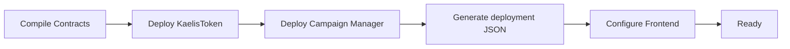
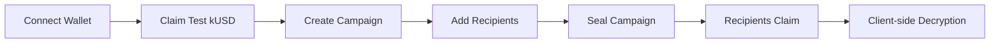

<div align="center">

# Kaelis

### Confidential Token Operations powered by iExec Nox

Privacy-first token distributions, vesting, payroll, and grants where recipient allocations remain encrypted end-to-end while every operation stays verifiable on-chain.

<br/>

[](https://sepolia.etherscan.io)
[](https://docs.iex.ec/nox-protocol/getting-started/welcome)
[](https://nextjs.org/)
[](https://www.typescriptlang.org/)
[](https://soliditylang.org/)
[](./LICENSE)

<br/>

[Live App](https://kaelis-phi.vercel.app) •
[Documentation](https://kaelis-phi.vercel.app/docs) •
[Architecture](./ARCHITECTURE.md) •
[Developer Feedback](./feedback.md)

</div>

---

> [!IMPORTANT]
>
> **Kaelis runs entirely on live infrastructure** — deployed on **Ethereum Sepolia** with **iExec Nox** confidential smart contracts. There is no mock data anywhere; every campaign, allocation, claim, and confidential computation shown comes directly from the deployed contracts.

---

# Table of Contents

- [Overview](#overview)
- [Why Kaelis?](#why-kaelis)
- [Features](#features)
- [Project Structure](#project-structure)
- [Prerequisites](#prerequisites)
- [Installation](#installation)
- [Configuration](#configuration)
- [Deploying the Contracts](#deploying-the-contracts)
- [Verifying the Deployment](#verifying-the-deployment-end-to-end)
- [Running the Frontend](#running-the-frontend)
- [Deploying the Frontend](#deploying-the-frontend)
- [Documentation](#documentation)
- [License](#license)

---

# Overview

Traditional token distribution platforms expose every recipient's allocation publicly on-chain — employee salaries, investor vesting, community rewards, treasury distributions, and grant funding are all visible to anyone inspecting the chain.

Kaelis changes this. Using **iExec Nox Confidential Computing**, allocation amounts stay encrypted through funding, distribution, vesting, payroll, grants, and claims. Recipients decrypt only their own allocations, organizations can selectively grant auditors viewing rights, and everyone else sees only that a confidential transaction occurred — not the values behind it.

> [!NOTE]
>
> Privacy and transparency aren't mutually exclusive: execution stays publicly verifiable on Ethereum while confidential values remain encrypted via iExec Nox.

---

# Why Kaelis?

> **Organizations shouldn't have to reveal sensitive financial information simply because they use a public blockchain.**

Most Web3 payroll, vesting, and airdrop platforms publish recipient allocations forever. Kaelis combines ERC-7984 confidential tokens, iExec Nox confidential computing, selective disclosure, confidential arithmetic, and encrypted claim flows to keep allocation data private while preserving Ethereum's trust guarantees.

| Traditional Platforms | Kaelis |
|-----------------------|---------|
| Public allocations | Confidential allocations |
| Public payroll | Confidential payroll |
| Public vesting | Confidential vesting |
| Public grants | Confidential grants |
| Public airdrops | Confidential distributions |
| Everyone sees payment amounts | Only authorized viewers decrypt amounts |

---

# Features

| Feature | Description |
|---------|-------------|
| Confidential Distributions | Create encrypted token distribution campaigns with private allocations. |
| Confidential Vesting | Linear vesting with optional cliff periods using encrypted balances. |
| Confidential Payroll | Confidential recurring payroll where employee allocations remain private. |
| Confidential Grants | Milestone-based grant distributions with encrypted claim amounts. |
| ERC-7984 Token | Native confidential token (`kUSD`) extending the official iExec reference implementation. |
| Faucet | Claim test kUSD directly from the application to fund confidential campaigns. |
| Confidential Claims | Recipients only see campaigns they are eligible to claim from. |
| Client-side Decryption | Eligible users decrypt only their own confidential allocations. |
| Selective Disclosure | Organizations can grant auditors controlled viewing permissions. |
| Live Sepolia Deployment | Every workflow executes against Ethereum Sepolia using deployed contracts. |
| RPC-Friendly Dashboard | Reads contract state directly instead of relying on expensive `eth_getLogs` scans. |

> [!TIP]
>
> Dashboard state is loaded through direct contract reads (`campaignCount()` and `getCampaign()`) rather than `eth_getLogs`, avoiding RPC block-range limitations across providers.

---

# Project Structure

<details open>
<summary><strong>Expand Project Structure</strong></summary>

```text
contracts/
├── KaelisCampaignManager.sol   Confidential distributions, vesting, payroll and grants
├── KaelisToken.sol             Native ERC-7984 confidential token (mint / burn / confidential transfers)

scripts/
├── deploy.ts        Deploys KaelisToken and KaelisCampaignManager
└── demo-flow.ts      End-to-end confidential workflow: mint → create campaign →
                       add recipient → seal → claim → decrypt

frontend/
├── app/
│   ├── page.tsx        Landing page
│   ├── app/
│   │   ├── dashboard/ distributions/ vesting/ payroll/ grants/ claims/ faucet/ docs/
│   └── api/faucet/
├── lib/                Wagmi configuration, Contract ABIs, Nox SDK, Addresses

ARCHITECTURE.md
feedback.md
README.md
```

</details>

> [!NOTE]
>
> The dashboard avoids event indexing wherever practical, querying contract state directly instead — making Kaelis resilient to RPC provider log limitations.

---

# Prerequisites

| Requirement | Description |
|-------------|-------------|
| Node.js | Version **20+** |
| Ethereum RPC | Sepolia RPC endpoint (Alchemy or Infura recommended) |
| Wallets | Two funded Sepolia wallets (Distributor + Recipient) |
| Browser Wallet | MetaMask, Rabby or another injected wallet |
| Network | Ethereum Sepolia |

> [!TIP]
>
> Kaelis currently supports **Injected Wallets only** — WalletConnect is intentionally disabled to keep the hackathon prototype focused on the confidential workflow.

---

# Installation

```bash
git clone https://github.com/Chikwenduagwu/Kaelis.git
cd Kaelis

# Install contract dependencies
npm install

# Install frontend dependencies
cd frontend && npm install && cd ..
```

> [!IMPORTANT]
>
> Install dependencies in both the root project and the `frontend` directory before deploying.

---

# Configuration

Kaelis uses two separate environment files.

## Root Environment

```bash
cp .env.example .env
```

```env
SEPOLIA_RPC_URL=https://eth-sepolia.g.alchemy.com/v2/YOUR_KEY
DEPLOYER_PRIVATE_KEY=0xyour_deployer_key
RECIPIENT_PRIVATE_KEY=0xyour_recipient_key
```

| Variable | Purpose |
|-----------|---------|
| SEPOLIA_RPC_URL | Ethereum Sepolia RPC endpoint |
| DEPLOYER_PRIVATE_KEY | Deploys contracts and funds campaigns |
| RECIPIENT_PRIVATE_KEY | Used by the demo script to perform confidential claims |

## Frontend Environment

```bash
cd frontend
cp .env.local.example .env.local
```

```env
NEXT_PUBLIC_KAELIS_TOKEN_ADDRESS=0x...
NEXT_PUBLIC_CAMPAIGN_MANAGER_ADDRESS=0x...
NEXT_PUBLIC_SEPOLIA_RPC_URL=https://eth-sepolia.g.alchemy.com/v2/YOUR_KEY
DEPLOYER_PRIVATE_KEY=0xyour_deployer_key
```

| Variable | Purpose |
|-----------|---------|
| NEXT_PUBLIC_KAELIS_TOKEN_ADDRESS | Deployed KaelisToken contract |
| NEXT_PUBLIC_CAMPAIGN_MANAGER_ADDRESS | Deployed Campaign Manager |
| NEXT_PUBLIC_SEPOLIA_RPC_URL | Frontend RPC endpoint |
| DEPLOYER_PRIVATE_KEY | Server-side faucet minting only |

> [!WARNING]
>
> `DEPLOYER_PRIVATE_KEY` **must never** be prefixed with `NEXT_PUBLIC_`. It's used exclusively by the Faucet API route and must stay server-side.

---

# Deploying the Contracts

```bash
npx hardhat compile
npm run deploy:sepolia
```

Deployment writes deployed addresses to `deployments/sepolia.json`. Copy the `KaelisToken` and `KaelisCampaignManager` addresses into `frontend/.env.local` and your Vercel Environment Variables before deploying the frontend.



---

# Verifying the Deployment End-to-End

```bash
npm run demo:sepolia
```

The script runs the full workflow automatically: mint confidential tokens → create campaign → add recipient → seal campaign → claim allocation → decrypt confidential result.

> [!IMPORTANT]
>
> This executes against **live Ethereum Sepolia contracts** using real confidential computation through iExec Nox — no mock values are generated.

| Step | Verification |
|-------|--------------|
| Mint | ERC-7984 confidential mint succeeds |
| Campaign | Campaign created successfully |
| Allocation | Recipient receives encrypted allocation |
| Claim | Confidential claim executes |
| Decryption | Recipient decrypts allocation successfully |

---

# Running the Frontend

```bash
cd frontend
npm run dev
```

Open `http://localhost:3000`, connect an injected wallet on **Ethereum Sepolia**, claim test **kUSD** from the Faucet page, then create your first confidential distribution or check your available claims.



> [!TIP]
>
> Every confidential value shown in the dashboard is decrypted **client-side** through the Nox SDK. No plaintext allocation values are ever stored on-chain.

---

# Deploying the Frontend

Kaelis is optimized for deployment on **Vercel**.

1. Import the repository into Vercel.
2. Set the Root Directory to `frontend`.
3. Add the required Environment Variables:

| Variable | Required |
|-----------|----------|
| NEXT_PUBLIC_KAELIS_TOKEN_ADDRESS | ✅ |
| NEXT_PUBLIC_CAMPAIGN_MANAGER_ADDRESS | ✅ |
| NEXT_PUBLIC_SEPOLIA_RPC_URL | ✅ |
| DEPLOYER_PRIVATE_KEY | ✅ (Server Only) |

4. Deploy — the dashboard immediately connects to the live Ethereum Sepolia contracts.

> [!IMPORTANT]
>
> `DEPLOYER_PRIVATE_KEY` should always remain a **server-side environment variable**. Never expose it with the `NEXT_PUBLIC_` prefix.

---

# A Note on Local Nox Testing

Kaelis intentionally skips the Docker-backed local Nox infrastructure from the Hardhat plugin. Every confidential operation runs directly against the live **Ethereum Sepolia** deployment via:

```ts
nox: {
    skipTestOverride: true
}
```

in `hardhat.config.ts` — keeping development simple while ensuring confidential operations run on real infrastructure rather than a local simulator. See **ARCHITECTURE.md** for implementation details.

---

# Privacy Guarantees

| Public Information | Confidential Information |
|--------------------|--------------------------|
| Campaign creation | Recipient allocation |
| Transaction sender | Claim amount |
| Transaction receiver | Remaining vesting balance |
| Transaction timestamp | Payroll amount |
| Contract addresses | Grant allocation |
| Campaign status | Total claimed amount |

> [!NOTE]
>
> Kaelis provides **confidentiality**, not anonymity. Wallet addresses remain visible on Ethereum as intended by the iExec Nox model — what's confidential are the sensitive financial values attached to those addresses.

---

# Technology Stack

| Layer | Technology |
|---------|------------|
| Frontend | Next.js 15 |
| Language | TypeScript |
| Styling | Tailwind CSS |
| Smart Contracts | Solidity 0.8.35 |
| Confidential Computing | iExec Nox |
| Confidential Token Standard | ERC-7984 |
| Wallet Integration | Wagmi + Viem |
| Blockchain | Ethereum Sepolia |
| Deployment | Vercel |

---

# Documentation

| Document | Description |
|-----------|-------------|
| ARCHITECTURE.md | Complete system architecture and confidential flow |
| feedback.md | Developer feedback and implementation experience with iExec Nox |
| In-App Documentation | End-user documentation inside the Kaelis dashboard |

---

# Hackathon Goals

Kaelis was built around the objectives of the iExec Nox Hackathon:

- Build a real end-to-end confidential DeFi application.
- Demonstrate composability with the Nox protocol.
- Eliminate mock data entirely.
- Deploy fully on Ethereum Sepolia.
- Deliver a production-quality user experience.
- Explore real-world confidential token operations.

---

# Future Improvements

- Batch campaign creation
- Multicall transaction execution
- Confidential treasury management
- Confidential DAO contributor payments
- Private recurring subscriptions
- Multi-token campaign support
- WalletConnect integration
- Cross-chain confidential distributions

---

# Contributing

Contributions, suggestions, and discussions are welcome. If you discover an issue or have an idea for improving Kaelis, feel free to open an issue or submit a pull request.

---

# License

This project is released under the MIT License. See [LICENSE](./LICENSE) for complete licensing information.

---

# Acknowledgements

Kaelis would not be possible without the incredible work of iExec, iExec Nox, OpenZeppelin, Ethereum, Next.js, Vercel, Wagmi, and Viem.

Special thanks to the iExec engineering team for their support during development and for helping diagnose a real-world multi-contract ACL issue while building Kaelis.

---

<div align="center">

# Kaelis

### Confidential Token Operations powered by iExec Nox

Privacy should be the default, not an afterthought.

Built with ❤️ for the **iExec Nox Hackathon**.

⭐ If you found this project interesting, consider starring the repository.

</div>
