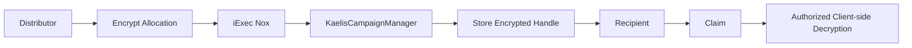
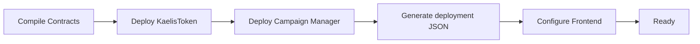
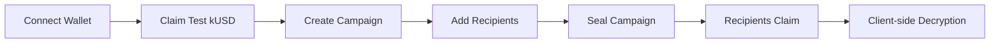

<div align="center">

# Kaelis

### Confidential Token Operations powered by iExec Nox

Privacy-first token distributions, vesting, payroll, and grants where recipient allocations remain encrypted end-to-end while every operation stays verifiable on-chain.

<br/>

[](https://sepolia.etherscan.io)
[](https://docs.iex.ec/nox-protocol/getting-started/welcome)
[](https://nextjs.org/)
[](https://www.typescriptlang.org/)
[](https://soliditylang.org/)
[](./LICENSE)

<br/>

[Live App](https://kaelis-phi.vercel.app) •
[Documentation](https://kaelis-phi.vercel.app/docs) •
[Architecture](./ARCHITECTURE.md) •
[Developer Feedback](./feedback.md)

</div>

---

> [!IMPORTANT]
>
> **Kaelis is built entirely on live infrastructure.**
>
> The project is deployed on **Ethereum Sepolia** and uses **iExec Nox** confidential smart contracts. There is **no mock data** anywhere in the application. Every campaign, encrypted allocation, claim, and confidential computation shown in the interface comes directly from the deployed contracts.

---

# Table of Contents

- [Overview](#overview)
- [Why Kaelis?](#why-kaelis)
- [Features](#features)
- [Architecture Overview](#architecture-overview)
- [Project Structure](#project-structure)
- [Prerequisites](#prerequisites)
- [Installation](#installation)
- [Configuration](#configuration)
- [Deploying the Contracts](#deploying-the-contracts)
- [Verifying the Deployment](#verifying-the-deployment-end-to-end)
- [Running the Frontend](#running-the-frontend)
- [Documentation](#documentation)
- [License](#license)

---

# Overview

Traditional token distribution platforms expose every recipient's allocation publicly on-chain.

Anyone can inspect the blockchain and immediately discover:

- Employee salaries
- Investor vesting allocations
- Community rewards
- Treasury distributions
- Grant funding

Kaelis changes this model entirely.

Using **iExec Nox Confidential Computing**, allocation amounts remain encrypted throughout their entire lifecycle:

- Funding
- Distribution
- Vesting
- Payroll
- Grants
- Claims

Recipients can securely decrypt only their own allocations.

Organizations can selectively grant viewing rights to auditors when required.

Everyone else only sees that a confidential transaction occurred without learning the underlying values.

---

> [!NOTE]
>
> Kaelis demonstrates that privacy and transparency are not mutually exclusive.
>
> Transaction execution remains publicly verifiable on Ethereum while confidential values remain encrypted using the iExec Nox Protocol.

---

# Why Kaelis?

Kaelis was designed to solve one fundamental problem:

> **Organizations should not have to reveal sensitive financial information simply because they use a public blockchain.**

Most Web3 payroll systems, vesting contracts, and airdrop platforms publish recipient allocations forever.

Kaelis introduces confidential token operations by combining:

- ERC-7984 Confidential Tokens
- iExec Nox Confidential Computing
- Selective Disclosure
- Confidential Arithmetic
- Encrypted Claim Flows

The result is a token operations platform that keeps sensitive allocation data private while preserving the trust guarantees of Ethereum.

---

# Features

| Feature | Description |
|---------|-------------|
| Confidential Distributions | Create encrypted token distribution campaigns with private allocations. |
| Confidential Vesting | Linear vesting with optional cliff periods using encrypted balances. |
| Confidential Payroll | Confidential recurring payroll where employee allocations remain private. |
| Confidential Grants | Milestone-based grant distributions with encrypted claim amounts. |
| ERC-7984 Token | Native confidential token (`kUSD`) extending the official iExec reference implementation. |
| Faucet | Claim test kUSD directly from the application to fund confidential campaigns. |
| Confidential Claims | Recipients only see campaigns they are eligible to claim from. |
| Client-side Decryption | Eligible users decrypt only their own confidential allocations. |
| Selective Disclosure | Organizations can grant auditors controlled viewing permissions. |
| Live Sepolia Deployment | Every workflow executes against Ethereum Sepolia using deployed contracts. |
| RPC-Friendly Dashboard | Reads contract state directly instead of relying on expensive `eth_getLogs` scans. |

---

> [!TIP]
>
> Kaelis intentionally avoids relying on `eth_getLogs` for dashboard state.
>
> Instead, campaign data is loaded directly through contract reads (`campaignCount()` and `getCampaign()`), avoiding RPC block-range limitations across providers.

---

# Architecture Overview

```text
                    Treasury / Distributor
                             │
                             │
                    Mint Confidential Tokens
                             │
                             ▼
                    KaelisToken (ERC-7984)
                             │
                             ▼
               KaelisCampaignManager Contract
                             │
          ┌──────────────────┼──────────────────┐
          │                  │                  │
          ▼                  ▼                  ▼
    Distribution         Payroll          Vesting
          │                  │                  │
          └──────────────┬───┴──────────────────┘
                         │
                         ▼
               Encrypted Recipient Allocation
                         │
                         ▼
              iExec Nox Confidential Compute
                         │
                         ▼
                  Recipient Claims Tokens
                         │
                         ▼
             Client-side Authorized Decryption
```

---

## Confidential Claim Flow



---

> [!IMPORTANT]
>
> Throughout the entire workflow, **allocation amounts never exist as plaintext on-chain**.
>
> Ethereum verifies the transaction.
>
> iExec Nox protects the confidential values.
>
> Kaelis orchestrates the confidential token operation.

---

---

# Project Structure

<details open>
<summary><strong>Expand Project Structure</strong></summary>

```text
contracts/
│
├── KaelisCampaignManager.sol
│     Confidential distributions, vesting, payroll and grants
│
├── KaelisToken.sol
│     Native ERC-7984 confidential token
│     (mint / burn / confidential transfers)
│
scripts/
│
├── deploy.ts
│     Deploys KaelisToken and KaelisCampaignManager
│
└── demo-flow.ts
      End-to-end confidential workflow
      Mint
      Create Campaign
      Add Recipient
      Seal Campaign
      Claim
      Decrypt
│
frontend/
│
├── app/
│   │
│   ├── page.tsx
│   │     Landing page
│   │
│   ├── app/
│   │
│   │   ├── dashboard/
│   │   ├── distributions/
│   │   ├── vesting/
│   │   ├── payroll/
│   │   ├── grants/
│   │   ├── claims/
│   │   ├── faucet/
│   │   └── docs/
│   │
│   └── api/
│       └── faucet/
│
├── lib/
│     Wagmi configuration
│     Contract ABIs
│     Nox SDK
│     Addresses
│
ARCHITECTURE.md
│
feedback.md
│
README.md
```

</details>

---

> [!NOTE]
>
> The dashboard intentionally avoids event indexing wherever practical.
> Instead, contract state is queried directly from the deployed contracts, making Kaelis resilient to RPC provider log limitations.

---

# Prerequisites

Before running Kaelis, ensure the following requirements are available.

| Requirement | Description |
|-------------|-------------|
| Node.js | Version **20+** |
| Ethereum RPC | Sepolia RPC endpoint (Alchemy or Infura recommended) |
| Wallets | Two funded Sepolia wallets (Distributor + Recipient) |
| Browser Wallet | MetaMask, Rabby or another injected wallet |
| Network | Ethereum Sepolia |

---

> [!TIP]
>
> Kaelis currently supports **Injected Wallets only**.
>
> WalletConnect is intentionally disabled to keep the hackathon prototype focused on the confidential workflow.

---

# Installation

Clone the repository.

```bash
git clone https://github.com/Chikwenduagwu/Kaelis.git
```

Move into the project.

```bash
cd Kaelis
```

Install contract dependencies.

```bash
npm install
```

Install frontend dependencies.

```bash
cd frontend

npm install

cd ..
```

---

> [!IMPORTANT]
>
> Install dependencies inside both the root project and the frontend directory before attempting deployment.

---

# Configuration

Kaelis uses two separate environment files.

- Root environment
- Frontend environment

---

## Root Environment

Create the root environment file.

```bash
cp .env.example .env
```

Example:

```env
SEPOLIA_RPC_URL=https://eth-sepolia.g.alchemy.com/v2/YOUR_KEY

DEPLOYER_PRIVATE_KEY=0xyour_deployer_key

RECIPIENT_PRIVATE_KEY=0xyour_recipient_key
```

### Variables

| Variable | Purpose |
|-----------|---------|
| SEPOLIA_RPC_URL | Ethereum Sepolia RPC endpoint |
| DEPLOYER_PRIVATE_KEY | Deploys contracts and funds campaigns |
| RECIPIENT_PRIVATE_KEY | Used by the demo script to perform confidential claims |

---

## Frontend Environment

Navigate into the frontend.

```bash
cd frontend
```

Create the local environment.

```bash
cp .env.local.example .env.local
```

Example:

```env
NEXT_PUBLIC_KAELIS_TOKEN_ADDRESS=0x...

NEXT_PUBLIC_CAMPAIGN_MANAGER_ADDRESS=0x...

NEXT_PUBLIC_SEPOLIA_RPC_URL=https://eth-sepolia.g.alchemy.com/v2/YOUR_KEY

DEPLOYER_PRIVATE_KEY=0xyour_deployer_key
```

### Variables

| Variable | Purpose |
|-----------|---------|
| NEXT_PUBLIC_KAELIS_TOKEN_ADDRESS | Deployed KaelisToken contract |
| NEXT_PUBLIC_CAMPAIGN_MANAGER_ADDRESS | Deployed Campaign Manager |
| NEXT_PUBLIC_SEPOLIA_RPC_URL | Frontend RPC endpoint |
| DEPLOYER_PRIVATE_KEY | Server-side faucet minting only |

---

> [!WARNING]
>
> `DEPLOYER_PRIVATE_KEY` **must never** be prefixed with `NEXT_PUBLIC_`.
>
> It is used exclusively by the Faucet API Route and should remain server-side.

---

# Deploying the Contracts

Compile the confidential contracts.

```bash
npx hardhat compile
```

Deploy to Ethereum Sepolia.

```bash
npm run deploy:sepolia
```

Deployment automatically creates

```text
deployments/sepolia.json
```

containing the deployed addresses for

- KaelisToken

- KaelisCampaignManager

Copy these addresses into

```text
frontend/.env.local
```

and into your Vercel Environment Variables before deploying the frontend.

---



---

# Verifying the Deployment End-to-End

Kaelis includes a complete confidential integration test.

Run

```bash
npm run demo:sepolia
```

The script performs the complete workflow automatically.

1. Mint confidential tokens

2. Create campaign

3. Add recipient

4. Seal campaign

5. Claim allocation

6. Decrypt confidential result

This verifies the complete confidential pipeline before opening the frontend.

---

> [!IMPORTANT]
>
> Unlike many hackathon demos, this script executes against **live Ethereum Sepolia contracts** using **real confidential computation** through iExec Nox.
>
> No mock values are generated during the process.

---

## What Gets Verified?

| Step | Verification |
|-------|--------------|
| Mint | ERC-7984 confidential mint succeeds |
| Campaign | Campaign created successfully |
| Allocation | Recipient receives encrypted allocation |
| Claim | Confidential claim executes |
| Decryption | Recipient decrypts allocation successfully |

---
---

# Running the Frontend

Start the Next.js development server.

```bash
cd frontend

npm run dev
```

Open your browser and navigate to:

```text
http://localhost:3000
```

Connect an injected wallet on **Ethereum Sepolia**, claim test **kUSD** from the Faucet page, then create your first confidential distribution or check your available claims.

---

## Application Flow



---

> [!TIP]
>
> Every confidential value displayed inside the dashboard is decrypted **client-side** through the Nox SDK.
>
> No plaintext allocation values are ever stored on-chain.

---

# Deploying the Frontend

Kaelis is optimized for deployment on **Vercel**.

## Step 1

Import the repository into Vercel.

---

## Step 2

Set the Root Directory.

```text
frontend
```

---

## Step 3

Add the required Environment Variables.

| Variable | Required |
|-----------|----------|
| NEXT_PUBLIC_KAELIS_TOKEN_ADDRESS | ✅ |
| NEXT_PUBLIC_CAMPAIGN_MANAGER_ADDRESS | ✅ |
| NEXT_PUBLIC_SEPOLIA_RPC_URL | ✅ |
| DEPLOYER_PRIVATE_KEY | ✅ (Server Only) |

---

## Step 4

Deploy.

Once deployment completes, the dashboard immediately connects to the live Ethereum Sepolia contracts.

---

> [!IMPORTANT]
>
> `DEPLOYER_PRIVATE_KEY` should always remain a **server-side environment variable**.
>
> Never expose it using the `NEXT_PUBLIC_` prefix.

---

# A Note on Local Nox Testing

Kaelis intentionally does **not** run the Docker-backed local Nox infrastructure provided by the Hardhat plugin.

Instead, every confidential operation executes directly against the live **Ethereum Sepolia** deployment, where the official iExec Nox infrastructure is already available.

The project explicitly enables:

```ts
nox: {
    skipTestOverride: true
}
```

inside `hardhat.config.ts`.

This keeps development simple while ensuring all confidential operations are executed on real infrastructure rather than a local simulator.

For additional implementation details, see:

- **ARCHITECTURE.md**

---

# Privacy Guarantees

One of Kaelis' primary goals is to demonstrate that confidential smart contracts can preserve privacy without sacrificing blockchain transparency.

| Public Information | Confidential Information |
|--------------------|--------------------------|
| Campaign creation | Recipient allocation |
| Transaction sender | Claim amount |
| Transaction receiver | Remaining vesting balance |
| Transaction timestamp | Payroll amount |
| Contract addresses | Grant allocation |
| Campaign status | Total claimed amount |

---

> [!NOTE]
>
> Kaelis provides **confidentiality**, not anonymity.
>
> Wallet addresses remain visible on Ethereum exactly as intended by the iExec Nox model.
>
> What remains confidential are the sensitive financial values attached to those addresses.

---

# Why Kaelis?

Traditional blockchain distribution platforms reveal financial information forever.

Kaelis demonstrates a different model.

| Traditional Platforms | Kaelis |
|-----------------------|---------|
| Public allocations | Confidential allocations |
| Public payroll | Confidential payroll |
| Public vesting | Confidential vesting |
| Public grants | Confidential grants |
| Public airdrops | Confidential distributions |
| Everyone sees payment amounts | Only authorized viewers decrypt amounts |

---

# Technology Stack

Kaelis combines modern frontend tooling with confidential smart contract infrastructure.

| Layer | Technology |
|---------|------------|
| Frontend | Next.js 15 |
| Language | TypeScript |
| Styling | Tailwind CSS |
| Smart Contracts | Solidity 0.8.35 |
| Confidential Computing | iExec Nox |
| Confidential Token Standard | ERC-7984 |
| Wallet Integration | Wagmi + Viem |
| Blockchain | Ethereum Sepolia |
| Deployment | Vercel |

---

# Documentation

Additional documentation is available throughout the repository.

| Document | Description |
|-----------|-------------|
| ARCHITECTURE.md | Complete system architecture and confidential flow |
| feedback.md | Developer feedback and implementation experience with iExec Nox |
| In-App Documentation | End-user documentation inside the Kaelis dashboard |

---

# Hackathon Goals

Kaelis was built around the objectives of the iExec Nox Hackathon.

- Build a real end-to-end confidential DeFi application.
- Demonstrate composability with the Nox protocol.
- Eliminate mock data entirely.
- Deploy fully on Ethereum Sepolia.
- Deliver a production-quality user experience.
- Explore real-world confidential token operations.

---

# Future Improvements

The current release focuses on confidential token distributions.

Future versions may include:

- Batch campaign creation
- Multicall transaction execution
- Confidential treasury management
- Confidential DAO contributor payments
- Private recurring subscriptions
- Multi-token campaign support
- WalletConnect integration
- Cross-chain confidential distributions

---

# Contributing

Contributions, suggestions, and discussions are welcome.

If you discover an issue or have an idea for improving Kaelis, feel free to open an issue or submit a pull request.

---

# License

This project is released under the MIT License.

See:

```text
LICENSE
```

for complete licensing information.

---

# Acknowledgements

Kaelis would not be possible without the incredible work of the following teams.

- iExec
- iExec Nox
- OpenZeppelin
- Ethereum
- Next.js
- Vercel
- Wagmi
- Viem

Special thanks to the iExec engineering team for their support during development and for helping diagnose a real-world multi-contract ACL issue while building Kaelis.

---

<div align="center">

# Kaelis

### Confidential Token Operations powered by iExec Nox

Privacy should be the default, not an afterthought.

Built with ❤️ for the **iExec Nox Hackathon**.

⭐ If you found this project interesting, consider starring the repository.

</div>
